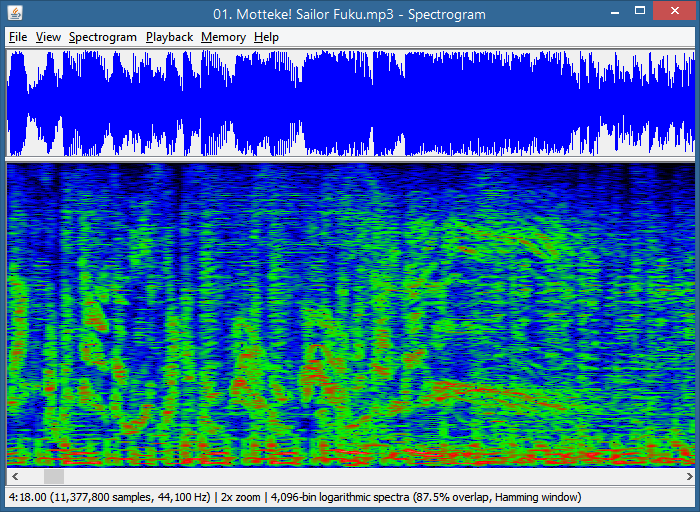

# Spectrogram

*A waveform and spectrogram of an MP3.*

This program can display waveforms and spectrograms for audio files, as well as the reverse process, converting spectrogram images back into audio.
